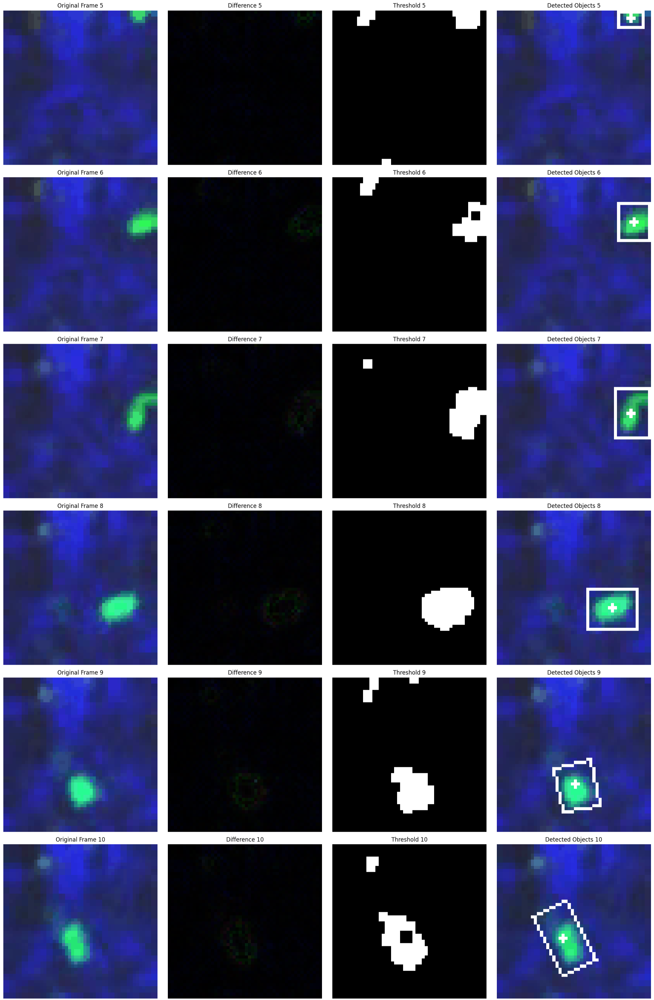

# Solution for The Cell Behavior Video Classification Challenge (CBVCC)

This repository contains our complete open-source solution for **[The Cell Behavior Video Classification Challenge (CBVCC)](https://www.immunemap.org/index.php/challenges-menu/cbvcc)**.

Our approach implements the efficient video action recognition method from the ICLR 2023 paper, ["AIM: Adapting Image Models for Efficient Video Action Recognition"](https://github.com/taoyang1122/adapt-image-models), utilizing the powerful and flexible [MMAction2](https://github.com/open-mmlab/mmaction2) toolbox as the underlying framework.

## Competition Results

| Model | AUC | Precision | Recall | Balanced Accuracy | Score | Checkpoint |
|---|---|---|---|---|---|---|
| SlowOnly-R101 | 0.750 | 0.535 | 0.920 | 0.674 | 0.726 | [Checkpoint](https://drive.google.com/file/d/1obDWwuRL7L-7cs4XvzQVLQJ0xKqPPCV7/view?usp=sharing) |
| TSM-R50 | 0.781 | 0.682 | 0.600 | 0.700 | 0.709 | [Checkpoint](https://drive.google.com/file/d/1-PvFloYKhWc-AMpPpB0OSyUkygAKYg96/view?usp=sharing) |
| SlowFast-R50 | 0.744 | 0.625 | 0.600 | 0.671 | 0.677 | [Checkpoint](https://drive.google.com/file/d/1bUldDHq1fnZ3OagqB6fGMwTjZ4sYvLT0/view?usp=sharing) |
| X3D-S | 0.769 | 0.750 | 0.360 | 0.637 | 0.657 | [Checkpoint](https://drive.google.com/file/d/1A-QvNRSovNEt6y-H1p0nataIBTa9UZf_/view?usp=sharing) |
| CSN | 0.669 | 0.417 | 1.000 | 0.500 | 0.651 | [Checkpoint](https://drive.google.com/file/d/1KEH1Eam3Z_BLHwko13ANBJAxbnEmgQ4A/view?usp=sharing) |
| TSM-R152 | 0.693 | 0.600 | 0.600 | 0.657 | 0.648 | [Checkpoint](https://drive.google.com/file/d/1EZPnmYfv4G-x_mGiv-d70JOd2q3o02s7/view?usp=sharing) |
| TSM-R101 | 0.726 | 0.600 | 0.480 | 0.626 | 0.631 | [Checkpoint](https://drive.google.com/file/d/1ZK--V-_SFVk0z1dixIp2fTyhVqJ3nb3R/view?usp=sharing) |
| ViTClip--large | 0.665 | 0.667 | 0.480 | 0.654 | 0.626 | [Checkpoint](https://drive.google.com/file/d/1NNqbLP6rFj26pNSOqfPSAId35TfQPc8V/view?usp=sharing) |
| ViTClip--base | 0.669 | 0.533 | 0.640 | 0.620 | 0.626 | [Checkpoint](https://drive.google.com/file/d/1Yo3Ui8usot8HerHBt35Dj0m7MP8QuNlV/view?usp=sharing) |
| Swin-small | 0.631 | 0.517 | 0.600 | 0.600 | 0.596 | [Checkpoint](https://drive.google.com/file/d/1X7HKqu4Dl5cTFGR_XONxanJqG7BkxcB0/view?usp=sharing) |
| Swin-tiny | 0.632 | 0.484 | 0.600 | 0.571 | 0.584 | [Checkpoint](https://drive.google.com/file/d/16O4DSxBvApuPYMPJexyUmcad8gREYsuM/view?usp=sharing) |
| TRN | 0.747 | 0.750 | 0.120 | 0.546 | 0.582 | [Checkpoint](https://drive.google.com/file/d/1isTBvMEGuYkEsl8P88ZVSVj1tIssb4hI/view?usp=sharing) |
| TSM-MobileNetV2 | 0.702 | 0.562 | 0.360 | 0.580 | 0.581 | [Checkpoint](https://drive.google.com/file/d/18X_oWNg1So3IoKl5hPGF0oPdSZNJY2fR/view?usp=sharing) |
| SlowOnly-R50 | 0.726 | 0.583 | 0.280 | 0.569 | 0.577 | [Checkpoint](https://drive.google.com/file/d/1E6jOLGSRMepmjtvaE5nD0z6TZD4xlItO/view?usp=sharing) |
| SlowFast-R101 | 0.655 | 0.556 | 0.400 | 0.586 | 0.570 | [Checkpoint](https://drive.google.com/file/d/1LpSpea9t508cF_S3PhKjItXi_JqFdFEQ/view?usp=sharing) |
| Swin-base | 0.578 | 0.436 | 0.680 | 0.526 | 0.560 | [Checkpoint](https://drive.google.com/file/d/1q45LkCoxP_TF55_ggyrMGYukgNFOw6dY/view?usp=sharing) |
| TSN-R50 | 0.603 | 0.500 | 0.480 | 0.569 | 0.551 | [Checkpoint](https://drive.google.com/file/d/1ARVtGlNN0_QMhuXqsMdylpOAU06BULM0/view?usp=sharing) |
| R2plus1D-R34 | 0.425 | 0.556 | 0.200 | 0.543 | 0.430 | [Checkpoint](https://drive.google.com/file/d/1BbOqZC7AgHB6RbKVzEvEEvZ-H5GPdV16/view?usp=sharing) |

## Installation
```shell
# create virtual environment
conda create -n AIM python=3.7.13
conda activate AIM

# install pytorch
conda install pytorch==1.10.0 torchvision==0.11.0 torchaudio==0.10.0 cudatoolkit=11.3 -c pytorch -c conda-forge

# install CLIP
pip install git+https://github.com/openai/CLIP.git

# install other requirements
pip install -r requirements.txt

# install mmaction2
python setup.py develop
```
### Install Apex:
We use apex for mixed precision training by default. To install apex, please follow the instructions in the [repo](https://github.com/NVIDIA/apex).

If you would like to disable apex, comment out the following code block in the [configuration files](configs/recognition/vit/):
```
# do not use mmcv version fp16
fp16 = None
optimizer_config = dict(
    type="DistOptimizerHook",
    update_interval=1,
    grad_clip=None,
    coalesce=True,
    bucket_size_mb=-1,
    use_fp16=True,
)
```

## Data Preparation
Download the Dataset: Obtain the video files and annotation lists from the official CBVCC competition website.

Structure the Data: Place the data according to the following directory structure. Our config files expect the videos to be in data/videos/ and the annotation .txt files to be in the data/ directory.

```text
adapt-image-models/
├── data/
│   ├── videos/
│   │   ├── video_000001.mp4
│   │   ├── video_000002.mp4
│   │   └── ...
│   ├── train_list_videos.txt
│   ├── phase1_list_videos.txt
│   └── ... 
├── configs/
│   └── recognition/
│       └── cbvcc/
│           ├── csn.py
│           ├── swin_vase.py
│           └── vitclip_base.py
└── ...
```


## Training
All configuration files for our CBVCC experiments are located in `configs/recognition/cbvcc/`. To run experiments, please use the following command. `PATH/TO/CONFIG` is the training config you want to use. The default training setting is 8GPU with a batchsize of 64.
```shell
bash tools/dist_train.sh <PATH/TO/CONFIG> <NUM_GPU> --test-last --validate --cfg-options model.backbone.pretrained=openaiclip work_dir=<PATH/TO/OUTPUT>
```
You can also modify `run_exp.sh` to easily switch between different model training sessions.

## Evaluation
The code will do the evaluation after training. If you would like to evaluate a model only, please use the following command,
```shell
bash tools/dist_test.sh <PATH/TO/CONFIG> <CHECKPOINT_FILE> <NUM_GPU> --eval top_k_accuracy
```

## Exploratory Script
This notebook `cell_detection_demo.ipynb` is a standalone exploratory tool and is not a part of the deep learning model's training pipeline.

It demonstrates an experimental approach to cell detection and tracking using traditional optical methods (background subtraction) on GIF files. The script identifies moving objects, filters out objects of specific colors (black, red, blue), and generates a visualization of the process.



## Acknowledgements
This project is built upon the excellent work of the original authors of AIM, VideoSwin, and MMAction2. Our sincere thanks go to them for open-sourcing their code.

